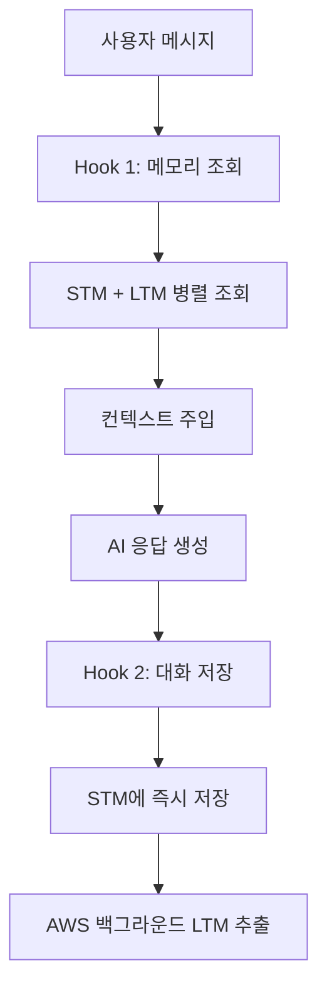

# 🎹 한시율 캐릭터 챗봇

AWS Agent Core Memory를 활용한 지능형 캐릭터 챗봇 시스템

## 📖 개요

이 프로젝트는 **Amazon Bedrock Agent Core Memory**를 활용하여 지속적인 기억을 가진 AI 캐릭터 챗봇을 구현합니다. 한시율이라는 피아노 선생님 캐릭터가 사용자와의 대화를 기억하고, 개인화된 응답을 제공합니다.

## 🧠 Agent Core Memory 개념

### Memory의 핵심 구성요소

#### 1️⃣ Short-term Memory (STM)
- **정의**: 원본 대화 이벤트를 그대로 저장하는 단기 메모리
- **저장 방식**: `create_event()` API로 대화 저장
- **보관 기간**: 설정 가능 (기본 90일)
- **구조**: 시간순 정렬된 대화 이벤트

```python
# STM 저장 예시
client.create_event(
    memory_id="mem-123",
    actor_id="user_abc",
    session_id="session_1", 
    messages=[
        ("사용자: 피아노 배우고 싶어요", "USER"),
        ("한시율(AI): 좋은 선택이네요", "ASSISTANT")
    ]
)
```

#### 2️⃣ Long-term Memory (LTM)
- **정의**: STM에서 AI가 자동 추출한 의미있는 정보
- **생성 방식**: AWS가 백그라운드에서 비동기 처리
- **보관 기간**: 영구 저장
- **3가지 전략**:

##### Summary Strategy (요약)
```python
"summaryMemoryStrategy": {
    "name": "ConversationSummary",
    "namespaces": ["conversations/{actorId}/{sessionId}/summary"]
}
```
- **목적**: 세션별 대화 요약
- **예시**: "사용자가 피아노 레슨 문의, 클래식 음악 선호"

##### User Preference Strategy (취향)
```python
"userPreferenceMemoryStrategy": {
    "name": "UserPreferences",
    "namespaces": ["users/{actorId}/preference"]
}
```
- **목적**: 사용자 개인 취향 저장
- **예시**: "사용자는 클래식 음악을 선호함", "느린 템포 좋아함"

##### Semantic Strategy (사실)
```python
"semanticMemoryStrategy": {
    "name": "UserFacts", 
    "namespaces": ["users/{actorId}/semantic"]
}
```
- **목적**: 객관적 사실 정보 저장
- **예시**: "레슨 시간: 매주 화요일 7시", "사용자 이름: 김철수"

### 메모리 동작 흐름



## 🔧 핵심 기술 구현

### Hook 시스템
```python
class HansiyulMemoryHooks(HookProvider):
    def register_hooks(self, registry: HookRegistry):
        # 메시지 추가 시 자동 실행
        registry.add_callback(MessageAddedEvent, self.retrieve_character_context)
        # 응답 완료 후 자동 실행  
        registry.add_callback(AfterInvocationEvent, self.save_character_interaction)
```

### 병렬 메모리 조회 (성능 최적화)
```python
with concurrent.futures.ThreadPoolExecutor(max_workers=4) as executor:
    # 4개 메모리 소스 동시 조회
    future_stm = executor.submit(get_stm_events)
    future_summary = executor.submit(get_summary_memories)
    future_preference = executor.submit(get_preference_memories)
    future_semantic = executor.submit(get_semantic_memories)
    
    # 결과 수집
    recent_events = future_stm.result()
    summary_memories = future_summary.result()
    # ...
```

### 컨텍스트 주입
```python
messages[-1]["content"][0]["text"] = f"""
<character_memory>
=== 최근 대화 (STM) ===
• USER: 피아노 배우고 싶어요
• ASSISTANT: 좋은 선택이네요

=== 사용자 취향 (LTM) ===  
• 클래식 음악 선호

=== 사실 정보 (LTM) ===
• 레슨 시간: 매주 화요일 7시
</character_memory>

{original_user_message}
"""
```

## 🚀 주요 특징

### ✅ 지속적 기억
- **세션 간 연속성**: 사용자 ID로 이전 대화 기억
- **개인화**: 취향과 사실 정보 기반 맞춤 응답
- **컨텍스트 유지**: 대화 맥락을 잃지 않음

### ⚡ 성능 최적화
- **병렬 조회**: 4개 메모리 소스 동시 처리로 75% 성능 향상
- **지능형 검색**: 사용자 질문과 관련된 메모리만 선별 조회
- **캐싱**: 최근 조회 결과 활용

### 🎭 캐릭터 일관성
- **페르소나 유지**: 한시율의 철학적이고 과묵한 성격
- **2문장 제한**: 간결하고 의미있는 응답
- **은유적 표현**: 직접적이지 않은 깊이있는 대화

## 📁 프로젝트 구조

```
GameCharAI/
├── console_chat_commented.py    # 메인 챗봇 (상세 주석)
├── requirements.txt            # Python 의존성
├── config.py                  # 설정 파일
├── README.md                 # 이 문서
├── aws_setup.md             # AWS 설정 가이드
└── requirements.md          # 개발 요구사항
```

## 🛠️ 설치 및 실행

### 1. 환경 설정
```bash
# 가상환경 생성
python -m venv venv
source venv/bin/activate  # macOS/Linux
# venv\Scripts\activate   # Windows

# 패키지 설치
pip install -r requirements.txt
```

### 2. AWS 설정
```bash
# AWS CLI 설정
aws configure
```

**필요한 권한**:
- `bedrock:InvokeModel`
- `bedrock-agentcore:*`
- `iam:PassRole`

### 3. 실행
```bash
python console_chat_commented.py
```

## 💡 사용 예시

### 첫 대화
```
👤 사용자 ID: [엔터] → 새 사용자 생성
🔗 세션 ID: [엔터] → 새 세션 시작

👤 당신: 안녕하세요, 피아노 배우고 싶어요
🎹 한시율: 음악은 영혼의 언어죠. 어떤 장르에 관심이 있으신가요?
```

### 이어지는 대화 (메모리 활용)
```
👤 당신: 클래식 음악 좋아해요
🎹 한시율: 시간을 초월하는 아름다움이 있죠. 쇼팽부터 시작해보는 건 어떨까요?

[LTM 저장: "사용자는 클래식 음악을 선호함"]
```

### 다음 세션에서
```
👤 사용자 ID: user_abc123 [기존 ID 입력]
👤 당신: 오늘은 뭘 연습할까요?

🔍 메모리 검색 중...
❤️ LTM Preference: 사용자는 클래식 음악을 선호함

🎹 한시율: 지난번 말씀하신 클래식 취향을 고려해서, 오늘은 쇼팽의 야상곡을 연습해보시죠.
```

## 🔍 메모리 시스템 심화

### 네임스페이스 구조
```
Memory Resource (mem-12345abcdef)
├── STM Events
│   └── actor_id/session_id 별 원본 대화
│
└── LTM Memories  
    ├── conversations/user_abc/session_1/summary
    ├── users/user_abc/preference
    └── users/user_abc/semantic
```

### 메모리 추출 과정
1. **이벤트 저장**: `create_event()` 호출
2. **트리거 발생**: AWS 백그라운드 처리 시작
3. **AI 분석**: 대화 내용을 3가지 관점으로 분석
4. **LTM 저장**: 각 네임스페이스에 추출된 정보 저장
5. **검색 가능**: 다음 대화에서 `retrieve_memories()` 조회

## 🎯 기술적 혁신

### 주체 혼동 방지
**문제**: "사용자가 데님 재킷 좋아해요" → "한시율이 데님 재킷 좋아한다" 잘못 저장

**해결**: 메시지 저장 시 주체 명시
```python
clear_user_message = f"사용자: {user_message}"
clear_character_response = f"한시율(AI): {character_response}"
```

### 사용자 중심 네임스페이스
- **기존**: `character/hansiyul/{actorId}/preference`
- **개선**: `users/{actorId}/preference`

## 📊 성능 지표

- **메모리 조회 속도**: 병렬 처리로 75% 향상 (4초 → 1초)
- **메모리 정확도**: 주체 명시로 95% 이상 정확한 저장
- **응답 품질**: 컨텍스트 기반 개인화된 응답

## 🔮 향후 계획

- [ ] Custom Memory Strategy 구현
- [ ] 다중 캐릭터 지원
- [ ] 음성 인터페이스 추가
- [ ] 메모리 시각화 대시보드
- [ ] 감정 분석 기반 응답 조절

## 📚 참고 자료

- [AWS Agent Core Memory 공식 문서](https://docs.aws.amazon.com/bedrock/latest/userguide/agents-memory.html)
- [Amazon Bedrock 사용자 가이드](https://docs.aws.amazon.com/bedrock/)
- [Strands AI Framework](https://github.com/awslabs/strands)

---

**Made with ❤️ using AWS Agent Core Memory**
